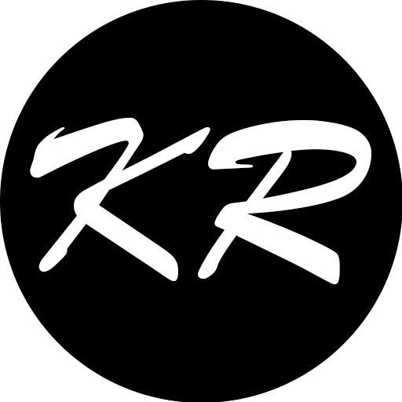

# My Personal Linktree

A modern, terminal-inspired linktree built with Next.js, designed to showcase my personal and professional links in a unique, interactive style. The design is based on my <a href="https://www.kalanroye.com">personal website</a>.

## Components Overview

- **Terminal**: Renders the styled terminal window, including the header and content area.
- **ConnectionsClient**: Handles the animated display of all personal and professional links, including the featured Crux Planner link.
- **TerminalText**: Animates text as if being typed in a terminal, with optional cursor and speed controls.
- **StaticTerminalText**: Displays static, preformatted terminal-style text without animation.

